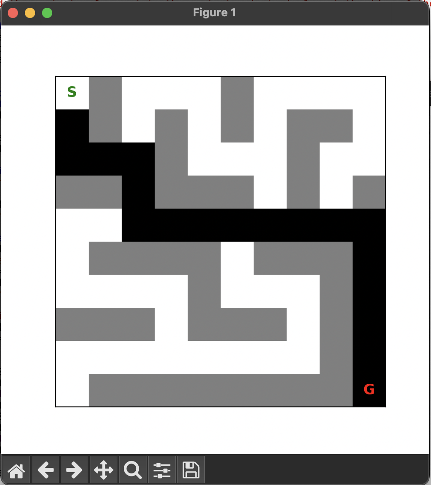

# SamratSMazeSolverAI

Samrat's Maze Solver AI is a program designed to automatically find the solution path in a maze using AI algorithms. It can navigate mazes of various sizes, considering walls and open paths, and visualizes the solution process.

## How it works
It uses the Breadth first Search algorithm. So what happens in BFS (Breadth First Search) is it searches for the solution in last-in first-out procedure. We have a frontier where all the moves are stored. There is an object called node which has its own state, parent, and action. State is basically the address of the node. Parent is the address from where the node came from and action is the possible addressess where the node can go to. 
I learned about this from CS50's Artificial Intelligence course on youtube. 
If you'd like to learn more about it, you can go to this [link]([url](https://www.youtube.com/watch?v=5NgNicANyqM&t=2443s))
link: https://www.youtube.com/watch?v=5NgNicANyqM&t=2443s

## Demo

## Features

- Supports mazes represented as 2D grids. 0 represents blank spaces and 1 represents walls.
- Uses AI pathfinding BFS algorithm.
- Finds shortest or optimal paths depending on the BFS algorithm.
- Visualizes the maze and the solution path.
- Handles different start and end points.
- Can solve large mazes efficiently.
